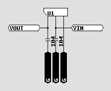

# diagram-in-comment helper(circuit).

- This is a helper script for circuit for diagram-in-comment.
- Please see: https://github.com/paijp/diagram-in-comment/

## cir.php

- This comment in your source....

```
/*jp.pa-i.cir/cir sip3 U1
22(4[VOUT])2{c104}2[[G]
22(66[VIN])2{c104}2[[G]
22222[[G]
```

- ....will be like this(full: https://paijp.github.io/diagram-in-comment-helper-jp.pa-i.cir/cir.html )....



- ....by this command.

```
$ php diacom.php <cir.php >cir.html
```

## map32mx2-28.php

- Show a pin assignment chart for Microchip PIC32MX2xx.
- https://paijp.github.io/diagram-in-comment-helper-jp.pa-i.cir/map32mx2-28.html from this code: https://github.com/paijp/diagram-in-comment-helper-jp.pa-i.cir/blob/main/map32mx2-28.php

## pcbgrid20.php

- Draw the layout of parts for a small universal PCB.
- https://paijp.github.io/diagram-in-comment-helper-jp.pa-i.cir/map32mx2-28.html from this code: https://github.com/paijp/diagram-in-comment-helper-jp.pa-i.cir/blob/main/pcbgrid20.html

## other samples.

- https://paijp.github.io/smallest-touchpanel-ui/pic32mx/lcdtp.html from this code: https://github.com/paijp/smallest-touchpanel-ui/blob/main/pic32mx/lcdtp.c

## install

```
$ git clone https://github.com/paijp/diagram-in-comment
$ git clone https://github.com/paijp/diagram-in-comment-helper-jp.pa-i.cir diagram-in-comment/helper/jp.pa-i.cir
$ git clone https://github.com/paijp/diagram-in-comment-helper-jp.pa-i.qr diagram-in-comment/helper/jp.pa-i.qr
```

